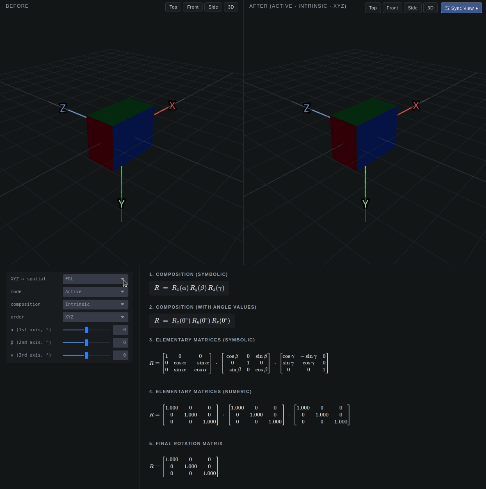

# Euler Angle Visualizer

> An interactive playground for understanding the 12 rotation orders, 24 spatial conventions, and the active/passive · intrinsic/extrinsic split — side by side, in real time.

**[Live demo → binue97.github.io/EulerAngleVisualizer](https://binue97.github.io/EulerAngleVisualizer/)**

<p align="center">
  
</p>

---

Euler angles are a notorious source of confusion in 3D, robotics, and computer vision. Every textbook uses a slightly different convention, and the same three numbers `(α, β, γ)` can mean four entirely different rotations depending on whether you read them as active or passive, intrinsic or extrinsic. This tool lets you tweak the angles and convention and *immediately see* the rotation, the new frame, and the full rotation matrix derivation — no setup, just open the demo.

## Features

- **Two synchronized 3D viewports** — see the object before and after the rotation simultaneously.
- **All four conventions** in one place: active intrinsic, active extrinsic, passive intrinsic, passive extrinsic.
- **12 rotation orders** — every Tait–Bryan (XYZ, ZYX, …) and proper-Euler (ZYZ, XYX, …) sequence.
- **24 spatial axis conventions** — FLU, FRD, RDF, RUB, … pick whichever your field uses.
- **Live LaTeX formula** — the composition, each elementary matrix, and the final numeric result are rendered with KaTeX as you drag the sliders.
- **Viewpoint presets** (Top, Front, Side, 3D) on each scene, plus a *Sync View* toggle that mirrors the left camera into the right scene in real time.
- **Zero install** — runs entirely in the browser.

## Why this exists

Most online references give you a static table of rotation matrices. That's fine if you already know what you're looking for, but it does nothing to build intuition for *why* `R_active_intrinsic_XYZ` is the transpose of `R_passive_extrinsic_XYZ`, or *what changes physically* when you swap FLU for FRD.

This visualizer makes those distinctions tactile. Pick a convention, move a slider, watch the box and the body axes move. The math panel updates in lockstep so you can trace any matrix entry back to the angle you just changed.

## Built with

[React](https://react.dev) · [Three.js](https://threejs.org) · [react-three-fiber](https://r3f.docs.pmnd.rs) · [drei](https://github.com/pmndrs/drei) · [leva](https://github.com/pmndrs/leva) · [KaTeX](https://katex.org) · [Vite](https://vitejs.dev)

## Run locally

Requires Node.js 18+.

```bash
git clone https://github.com/binue97/EulerAngleVisualizer.git
cd EulerAngleVisualizer
npm install
npm run dev
```

Open the URL Vite prints (defaults to `http://localhost:5173/EulerAngleVisualizer/`).

To produce a production build:

```bash
npm run build      # outputs to dist/
npm run preview    # serve the built bundle locally
```

## Contributing

Issues and pull requests are welcome. If you find a convention that's missing, a formula that disagrees with your favorite textbook, or just a UI rough edge — please open an issue.

## License

[MIT](LICENSE) © B.NU
